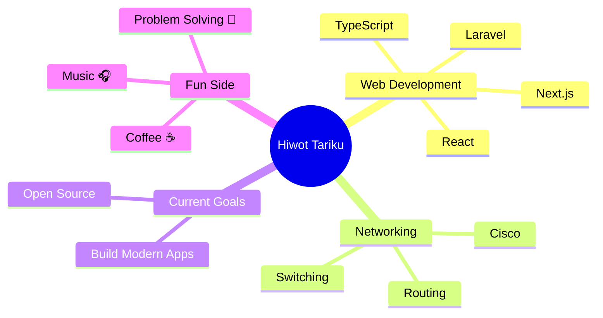

````md
<div align="center">


# Hi, I'm 👋

# Hiwot Tariku

### Full-Stack Developer 🚀


<br>


</div>

---

# 💻 Developer Code

```javascript
const developer = {
  name: "Hiwot Tariku",
  role: "Full-Stack Developer 🚀",
  passion: "Building the Web",
  learning: "Every Day",
  goal: "Make an Impact",
};

while(alive){
   code();
   learn();
   build();
   repeat();
}
````

---

# 🌟 About Me

<table>
<tr>

<td width="50%">

## 👩‍💻 About Me

* 🎓 IT Student passionate about technology
* 🌐 Full-Stack Web Developer
* 🖧 Cisco Networking Enthusiast
* 📚 Learning Next.js & TypeScript
* 💡 Love building creative projects
* 😄 Fun fact: I love solving puzzles

</td>

<td width="50%">


</td>

</tr>
</table>

---

# 🚀 What I'm Up To

<table>
<tr>

<td width="50%">

## 🚀 Current Work

* 🛒 E-commerce Platform
* 📍 Local Vendor Finder App
* 🌐 Personal Portfolio

</td>

<td width="50%">

## 📚 Learning

* Next.js
* Advanced TypeScript
* Backend Architecture
* Cisco Networking

</td>

</tr>
</table>

---

# ⚡ Tech Stack

<div align="center">


</div>

---

# 📊 GitHub Stats

<div align="center">


</div>

<br>

<div align="center">


</div>

---

# 🧠 Developer Mindset



---

# 🚀 Featured Projects

<table>
<tr>

<td width="33%">

## 🛒 E-commerce Platform

Full-stack e-commerce platform with React, Laravel & MySQL.

<a href="#">
  
</a>

</td>

<td width="33%">

## 📍 Local Vendor Finder

Find local vendors easily.

Built with Next.js & Tailwind.

<a href="#">
  
</a>

</td>

<td width="33%">

## 💻 Personal Portfolio

Modern portfolio built with Next.js & Framer Motion.

<a href="#">
  
</a>

</td>

</tr>
</table>

---

# 🐍 Contribution Snake

<div align="center">


</div>

---

# 🌐 Connect With Me

<div align="center">

<a href="https://github.com/YOUR_USERNAME">

</a>

<a href="https://linkedin.com/in/YOUR_LINK">

</a>

<a href="https://instagram.com/YOUR_INSTAGRAM">

</a>

<a href="mailto:YOUR_EMAIL">

</a>

</div>

---

# ☕ Support Me

<div align="center">

If you like my work, consider giving a ⭐ to my repositories!

</div>

---

<div align="center">

# ⚡ Final Quote

### Turning coffee into code, ideas into reality, and bugs into features.


</div>
```
